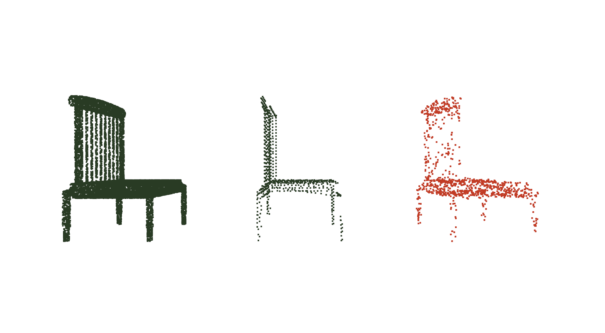

# 3DNetworksPytorch

This repository is meant as way to learn by implementating them, different 3D deep learning architectures for pointclouds. I haven't tested them on benchmark datasets for the papers, only on some toy examples. If You spot any mistake, I am open to pull requests and any colaboration on the topic.

(I haven't cleaned the code completly so it might seem a bit messy at first sight)
Most of the networks are using the cuda code in cppattempt. Please go in there and install the extension (python setup.py install), so that they can import it.
The only things required should be pytorch 1.0+ and the corresponding cudatoolkit, everything configured correctly obviously. See pytorch explanations for how to compile C++ extensions.

## PointSift
An implementation of PointSift using Pytorch (https://arxiv.org/pdf/1807.00652.pdf) lies in the PoinSift folder.
The C_utils folder contains some algorithms inplemented in CUDA and C++ taken from the original implementation of PointSift (https://github.com/MVIG-SJTU/pointSIFT) but wrapped to be used with Pytorch Tensor directly.

## PointCNN
An implementation of PointCNN using Pytorch (https://arxiv.org/pdf/1801.07791.pdf) lies in the PointCNN folder.

## PointNet++
An implementation of PointNet++ using Pytorch (https://arxiv.org/pdf/1706.02413.pdf) lies in the PointNet++ folder.
It uses the same algorithms on GPU as PointSift as Pointsift uses Pointnet++ modules.

## Cuda Extension
There are two versions of the cuda extensions for pointnet and pointsift. The first one is in C_utils and was implemented using the old C api for torch. As it is now deprecated in newer version of pytorch and they recommend using the C++ extension api, I did an attempt in cppattempt folder.
## 3D-BoNet

Quick implementation of 3D-BoNet (https://arxiv.org/pdf/1906.01140.pdf) https://gist.github.com/lelouedec/5a7ba5547df5cef71b50ab306199623f using pytorch. All in one file, need to compile C++ pointnet extension. Code not converging for bounding boxes regressions

## SPGN

Implementation of SGPN (https://arxiv.org/pdf/1711.08588.pdf) based on Pointnet implementation.

### PCN
Implementation of PCN (PCN: Point Completion Network) (https://arxiv.org/pdf/1808.00671.pdf) (https://github.com/wentaoyuan/pcn) using pytorch. For the chamfer distance and the EMD loss, I used inplementation from respectively https://github.com/chrdiller/pyTorchChamferDistance and https://github.com/daerduoCarey/PyTorchEMD. See these repositories for how to use them. Copy emd.py and the compiled ".so" lib to the same directory of your model and it should be fine. 
Tested with the PCN paper shapenet data, download it from the google drive provided in their repository. The dataloader will help loading the pointclouds from the shapenet directory. See following screenshot for example: 

